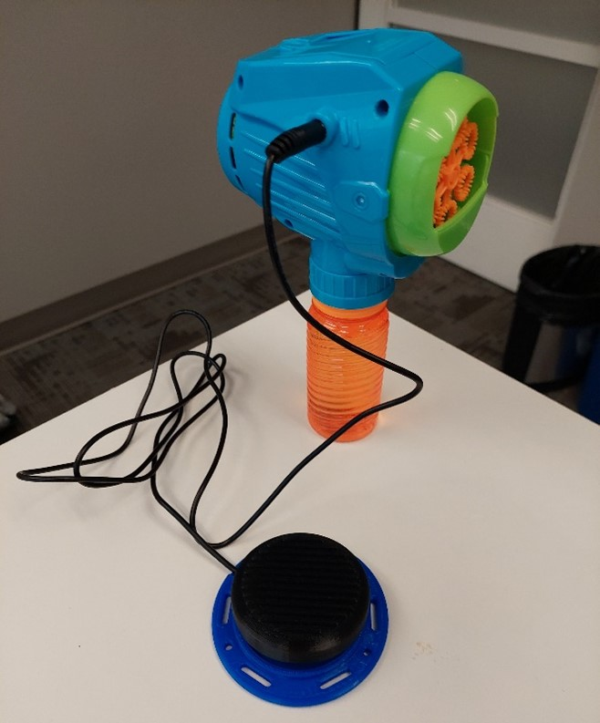

# Switch Adapted Bubble Blower Fan
The Switch Adapted Bubble Blower Fan is a commercial toy modified for use with an assistive switch. The Switch Adapted Bubble Blower may be beneficial to someone who may have difficulty pressing the original small activation button due to its size, location, or required activation force.

Attach an assistive switch with a 3.5 mm plug to the 3.5 mm jack on the toy. When the assistive switch is activated, the toy will generate bubbles. 

## More info at
- [Makers Making Change Project Page](https://makersmakingchange.com/project/switch-adapted-bubble-blower-fan/)

## How to Obtain a Switch Adapted Bubble Blower Fan
### 1. Do it Yourself (DIY) or Do it Together (DIT)

This is an open-source assistive technology, so anyone is free to build it. All of the files and instructions required to build the Switch Adapted Bubble Blower Fan are contained within this repository. Refer to the Maker Checklist below.

### 2. Request a build of this device

If you would like to obtain a Switch Adapted Bubble Blower Fan , you may submit a build request through the [MMC Library Page](https://makersmakingchange.com/project/switch-adapted-bubble-blower-fan/). The requestor is responsible for the cost of materials and any shipping.

### 3. How to build this device for someone else

If you have the skills and equipment to build this device, and would like to donate your time to create the switch for someone who needs it, visit the [MMC Maker Wanted](https://makersmakingchange.com/maker-wanted/) section.

## Getting Started

### 1. Read the Makers Checklist

The Makers Checklist provides an outline of all the steps required to create the switch adapted toy.

### 2. Order the Off-The-Shelf Components

The [Bill of Materials](/Documentation/BubbleBlowerFan_BOM.xlsx) lists all of the parts and components required to build the device.

### 3. Assemble the Switch Adapted Bubble Blower Fan

Reference the [Assembly Guide](/Documentation/BubbleBlowerFan_Assembly_Guide_v1.0.pdf) for the tools and steps required.

## Files
### Documentation
| Document             | Version | Link |
|----------------------|---------|------|
| Design Rationale     | 1.0     | [BubbleBlowerFan_Design_Rationale](/Documentation/BubbleBlowerFan_Design_Rationale_v1.0.pdf)     |
| Maker Checklist      | 1.0     | [BubbleBlowerFan_Maker_Checklist](/Documentation/BubbleBlowerFan_Maker_Checklist_v1.0.pdf)     |
| Bill of Materials    | 1.0     | [BubbleBlowerFan_Bill_of_Materials](/Documentation/BubbleBlowerFan_BOM_v1.0.xlsx)     |
| 3D Printing Guide    | 1.0     | [BubbleBlowerFan_3D_Printing_Guide](/Documentation/BubbleBlowerFan_3D_Printing_Guide_v1.0.pdf)     |
| Assembly Guide       | 1.0     | [BubbleBlowerFan_Assembly_Guide](/Documentation/BubbleBlowerFan_Assembly_Guide_v1.0.pdf)     |
| User Guide           | 1.0     | [BubbleBlowerFan_User_Guide](/Documentation/BubbleBlowerFan_Quick_Guide_v1.0.pdf)    |
| Changelog            | 1.0     | [BubbleBlowerFan_Changelog](/Documentation/BubbleBlowerFan_Changelog_v1.0.pdf)     |

### Design Files
[CAD Files](/Design_Files)

### Build Files
 - [3D Printing Files](/Build_Files/3D_Printing)

## Attribution
Modification method and documentation created by Neil Squire / Makers Making Change.

## License
Everything needed or used to design, make, test, or prepare the Switch Adapted Bubble Blower Fan is licensed under the CERN 2.0 Permissive license <https://ohwr.org/project/cernohl/wikis/Documents/CERN-OHL-version-2> (CERN-OHL-P) . 

Accompanying material such as instruction manuals, videos, and other copyrightable works that are useful but not necessary to design, make, test, or prepare the Switch Adapted Bubble Blower Fan are published under a Creative Commons Attribution-ShareAlike 4.0 license https://creativecommons.org/licenses/by-sa/4.0/ (CC BY-SA 4.0).

## About Us

Makers Making Change is an initiative of [Neil Squire](https://www.neilsquire.ca/), a Canadian non-profit that helps people with disabilities.

We are committed to creating a network of volunteer makers who support people with disabilities in their communities through 3D printing assistive devices. Check out our library of free, open-source assistive technologies with parts and build instructions.

 - Website: [www.MakersMakingChange.com](https://www.makersmakingchange.com/)
 - GitHub: [https://github.com/makersmakingchange](https://github.com/makersmakingchange)
 - Twitter: [@makermakechange](https://twitter.com/makermakechange)
 - Instagram: [@makersmakingchange](https://www.instagram.com/makersmakingchange)

## Contact Us

For technical questions, to get involved, or share your experience we encourage you to visit the [MMC Website](https://www.makersmakingchange.com/), [MMC Forum](https://makersmakingchange.com/forum), or contact info@makersmakingchange.com
